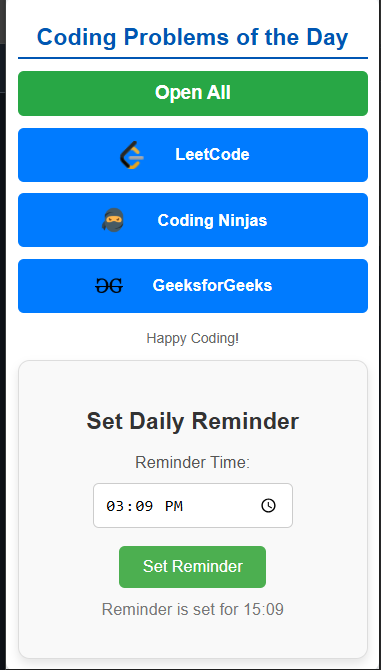

# 🚀 Coding Problems of the Day - Chrome Extension  

**Stay on track with your daily coding practice!**  
This Chrome Extension helps you access "Problem of the Day" from platforms like LeetCode, GeeksforGeeks, Coding Ninjas, and more—all in one place.  

---

## 📸 Preview  

### Popup Interface:  
  

### Reminder Notification:  
  

---

## 🌟 Features  

- **Daily Problems Aggregator**:  
  Access links to coding problems from platforms like:  
    - 🟦 LeetCode  
    - 🟧 Coding Ninjas  
    - 🟩 GeeksforGeeks  

- **Open All Links**:  
  Use the "Open All" button to open all problem links in separate tabs with a single click.  

- **Daily Reminder**:  
  - Set a reminder for your preferred time to solve problems.  
  - Receive browser notifications to stay consistent.  
  - **Snooze Reminder**: Delay notifications for 30 minutes if needed.  

---

## 🛠 Installation  

1. **Clone or Download the Repository**:  
   ```bash
   git clone https://github.com/your-username/coding-problems-chrome-extension.git
   cd coding-problems-chrome-extension
   ```

2. **Load the Extension into Chrome**:  
   - Open **chrome://extensions/** in your Chrome browser.  
   - Enable **Developer Mode** (toggle in the top-right corner).  
   - Click **Load Unpacked** and select the folder where this project is located.  

3. **Pin the Extension**:  
   - Pin the extension to your toolbar to access it easily.  

---

## 🚀 Usage  

1. Click on the extension icon to open the popup.  
2. **Access Problems**:  
   - Click on individual platform links (e.g., LeetCode, Coding Ninjas).  
   - Use **Open All** to open all links at once.  
3. **Set Daily Reminder**:  
   - Input your preferred time and click "Set Reminder."  
   - A notification will appear at the scheduled time.  
   - Use "Snooze" to delay by 30 minutes.  

---

## 📷 Screenshots  

### Popup View  
  

### Notification View  
  

---

## 🧩 How to Customize  

This project is **open-source** and customizable! Feel free to:  
- Add more platforms or modify the existing ones.  
- Update the reminder durations.  
- Enhance the design and functionality.  

**Fork the repo and make it your own!**  

---

## 👨‍💻 Contributing  

1. Fork the repository.  
2. Create a new branch for your feature/fix:  
   ```bash
   git checkout -b feature-name
   ```  
3. Commit your changes and push:  
   ```bash
   git commit -m "Add new feature"
   git push origin feature-name
   ```  
4. Submit a Pull Request.  

---


### ⭐ **Star this repository if you find it useful!** ⭐  

---
